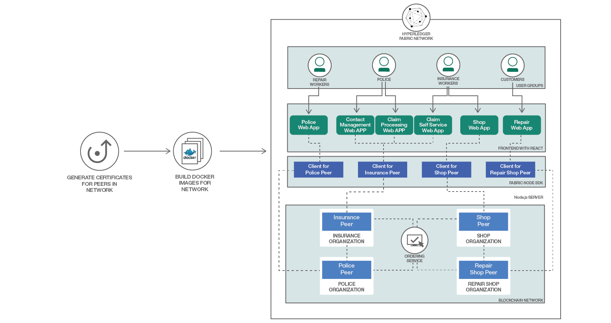
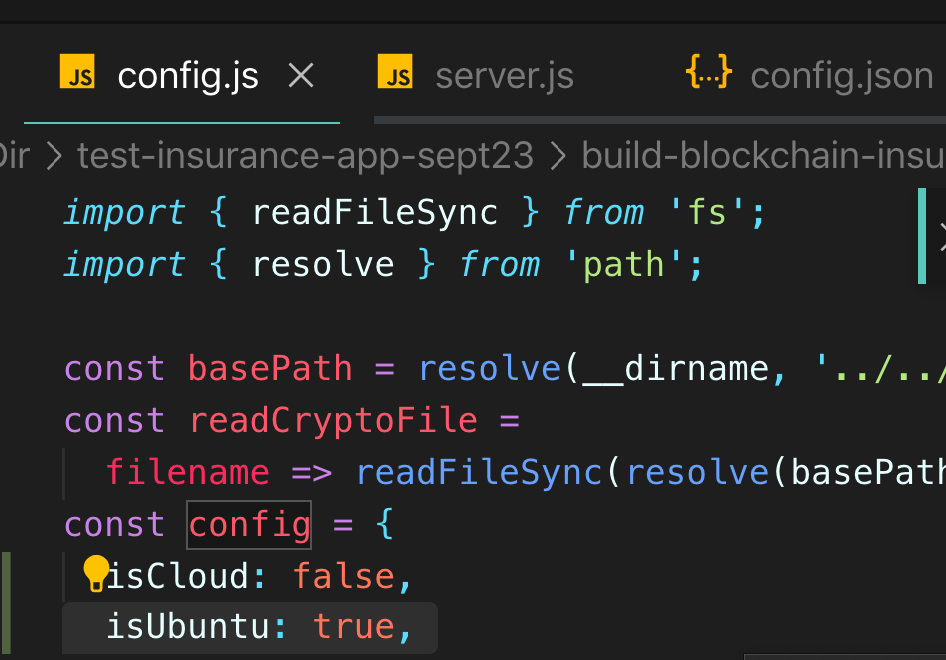
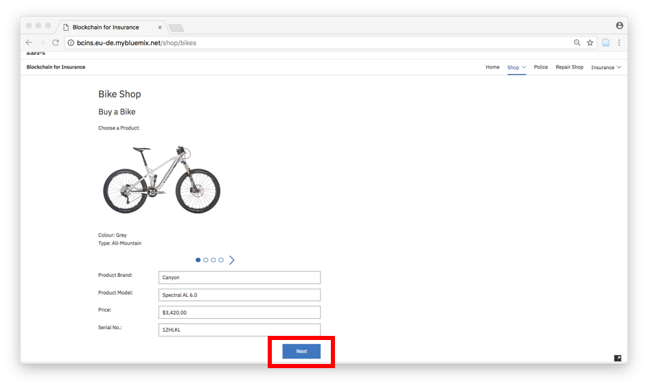
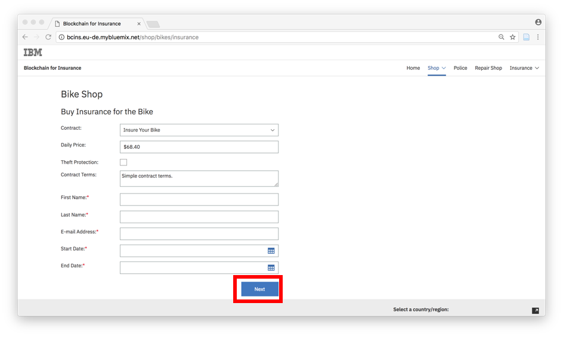
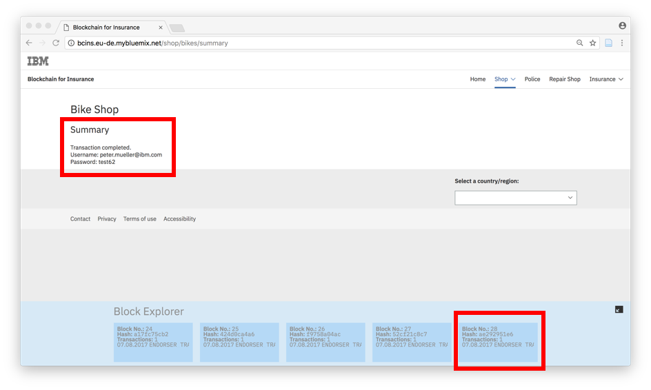
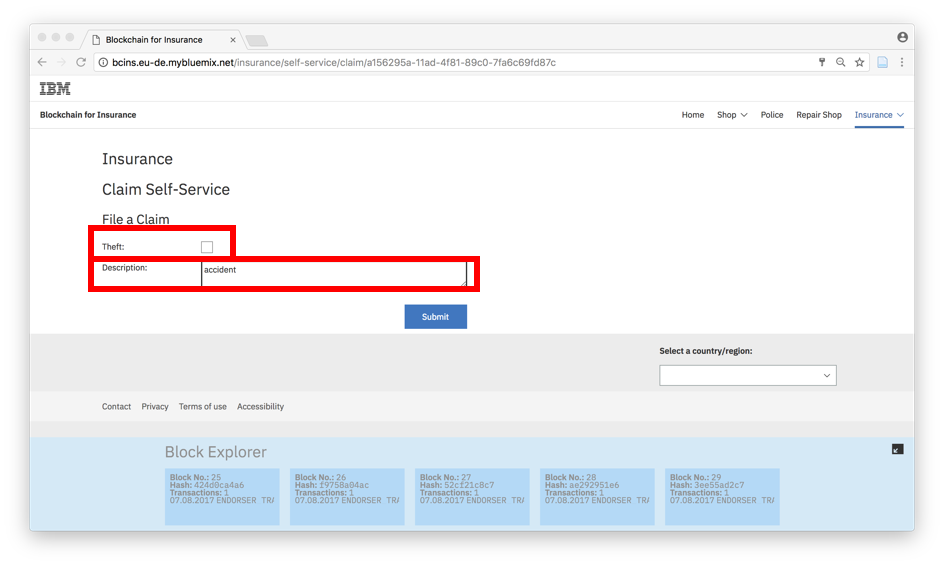
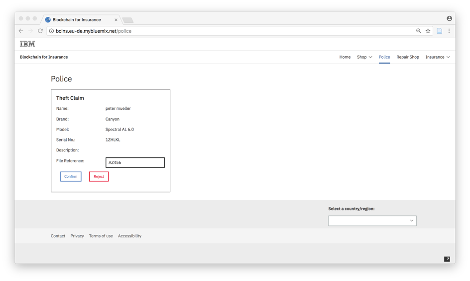
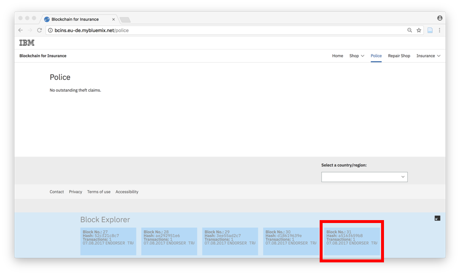
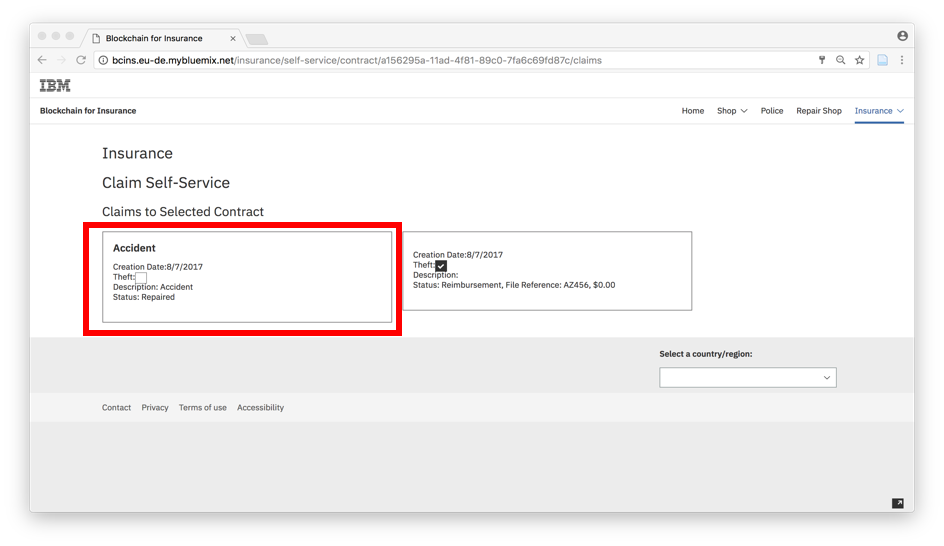
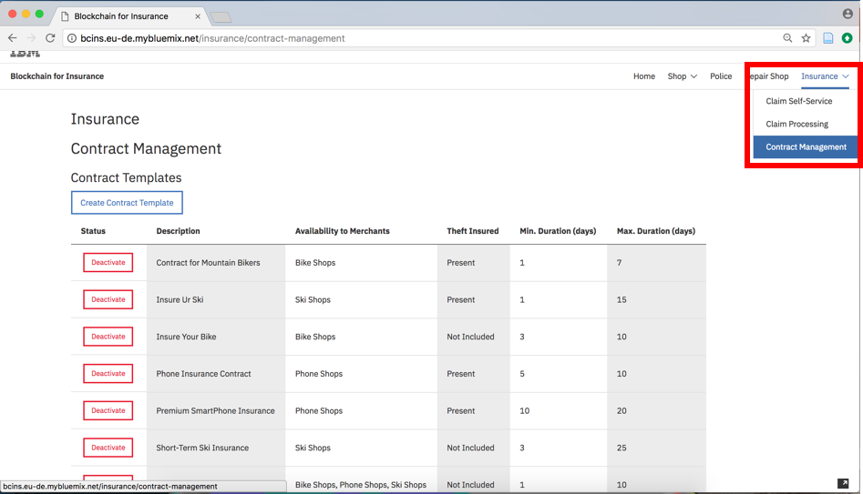

*Read this in other languages: [中国語](README-cn.md),[日本語](README-ja.md).*

# Build Blockchain Insurance Application

This project showcases the use of blockchain in insurance domain for claim processing. In this application, we have four participants, namely insurance, patient, repair doctor and doctor peer. Insurance peer is the insurance company providing the insurance for the products and it is responsible for processing the claims. Patient peer is responsible for verifying the theft claims. Repair doctor peer is responsible for repairs of the product while doctor peer sells the products to consumer.

Audience level : Intermediate Developers

## Included Components
* Hyperledger Fabric
* Docker

## Application Workflow Diagram


* Generate Certificates for peers
* Build Docker images for network
* Start the insurance network

## Prerequisites
We find that Blockchain can be finicky when it comes to installing Node. We want to share this [StackOverflow response](https://stackoverflow.com/questions/49744276/error-cannot-find-module-api-hyperledger-composer) - because many times the errors you see with Compose are derived in having installed either the wrong Node version or took an approach that is not supported by Compose:

* [Docker](https://www.docker.com/products) - latest
* [Docker Compose](https://docs.docker.com/compose/overview/) - latest
* [NPM](https://www.npmjs.com/get-npm) - latest
* [nvm]() - latest
* [Node.js](https://nodejs.org/en/download/) - latest
* [Git client](https://git-scm.com/downloads) - latest
* **[Python](https://www.python.org/downloads/) - 2.7.x**

## Steps

1. [Run the application](#1-run-the-application)

## 1. Run the application

Clone the repository:
```bash
git clone https://github.com/IBM/build-blockchain-insurance-app
```

In the editor of choice, make sure [line 8 of build-blockchain-insurance-app/web/www/blockchain/config.js](https://github.com/IBM/build-blockchain-insurance-app/blob/ubuntu/local-fix/web/www/blockchain/config.js#L8) file is set to `isCloud: false`. Note that if this is your first time using the repo, this value defaults to `isCloud: false`.

Login using your [docker hub](https://hub.docker.com/) credentials.
```bash
docker login
```

Run the build script to download and create docker images for the orderer, insurance-peer, patient-peer, doctor-peer, pharma-peer, web application and certificate authorities for each peer. This will run for a few minutes.

For Mac user:
```bash
cd build-blockchain-insurance-app
./build_mac.sh
```

For Ubuntu user:

**Note: this pattern has been tested, and is working on a system with the following specs:**
1. Ubuntu Linux 18.04 LTS Bionic Beaver Minimal Install
2. Docker version 18.09.6, build 481bc77 
3. docker-compose version 1.24.0, build 0aa59064

 Change
[line 9 of of build-blockchain-insurance-app/web/www/blockchain/config.js](https://github.com/IBM/build-blockchain-insurance-app/blob/ubuntu/local-fix/web/www/blockchain/config.js#L9) file to `isUbuntu: true` as shown in the image below:


Then, run the following commands in your terminal window:

```bash
cd build-blockchain-insurance-app
./build_ubuntu.sh
```

You should see the following output on console:
```
Creating pharma-ca ...
Creating insurance-ca ...
Creating doctor-ca ...
Creating patient-ca ...
Creating orderer0 ...
Creating pharma-ca
Creating insurance-ca
Creating patient-ca
Creating doctor-ca
Creating orderer0 ... done
Creating insurance-peer ...
Creating insurance-peer ... done
Creating doctor-peer ...
Creating doctor-peer ... done
Creating pharma-peer ...
Creating pharma-peer ... done
Creating web ...
Creating patient-peer ...
Creating web
Creating patient-peer ... done
```

**Wait for few minutes for application to install and instantiate the chaincode on network**

Check the status of installation using command:
```bash
docker logs web
```
On completion, you should see the following output on console:
```
> blockchain-for-insurance@2.1.0 serve /app
> cross-env NODE_ENV=production&&node ./bin/server

/app/app/static/js
Server running on port: 3000
Default channel not found, attempting creation...
Successfully created a new default channel.
Joining peers to the default channel.
Chaincode is not installed, attempting installation...
Base container image present.
info: [packager/Golang.js]: packaging GOLANG from bcins
info: [packager/Golang.js]: packaging GOLANG from bcins
info: [packager/Golang.js]: packaging GOLANG from bcins
info: [packager/Golang.js]: packaging GOLANG from bcins
Successfully installed chaincode on the default channel.
Successfully instantiated chaincode on all peers.
```

🚨🚨At this point, if you run into any errors, please check the troubleshooting section at the 
bottom of the page for 
common fixes! This is likely due to a difference in Ubuntu, Docker, or Docker-compose version.🚨🚨

Use the link http://localhost:3000 to load the web application in browser.

The home page shows the participants (Peers) in the network. You can see that there is an Insurance, Repair Doctor, Patient and Doctor Peer implemented. They are the participants of the network.


Imagine being a consumer (hereinafter called “Biker”) that wants to buy a phone, bike or Ski. By clicking on the “Go to the doctor” section, you will be redirected to the doctor (doctor peer) that offers you the following products.


You can see the three products offered by the doctor(s) now. In addition, you have insurance contracts available for them. In our scenario, you are an outdoor sport enthusiast who wants to buy a new Bike. Therefore, you’ll click on the Bike Doctor section.


In this section, you are viewing the different bikes available in the store. You can select within four different Bikes. By clicking on next you’ll be forwarded to the next page which will ask for the customer’s personal data.



You have the choice between different insurance contracts that feature different coverage as well as terms and conditions. You are required to type-in your personal data and select a start and end date of the contract. Since there is a trend of short-term or event-driven contracts in the insurance industry you have the chance to select the duration of the contract on a daily basis. The daily price of the insurance contract is being calculated by a formula that had been defined in the chaincode. By clicking on next you will be forwarded to a screen that summarizes your purchase and shows you the total sum.



The application will show you the total sum of your purchase. By clicking on “order” you agree to the terms and conditions and close the deal (signing of the contract). In addition, you’ll receive a unique username and password. The login credentials will be used once you file a claim.  A block is being written to the Blockchain.

>note You can see the block by clicking on the black arrow on the bottom-right.


Login credentials. Block written to the chain.



Once an incident has happened the Biker can file a claim on his own by selecting the “claim Self-Service” tab.


The Biker will be asked to login by using the credentials that had been given to him before.


He can file a new claim by selecting the tab shown above.


The Biker can briefly describe the damage on his bike and/or select whether it has been stolen. In case the Bike has been stolen the claim will be processed through the patient who has to confirm or deny the theft (option 1). In case there was just a damage the claim will be processed through the repair doctor (option 2). In the following section, we will start with option 1.



**Option 1**

Once the Biker has submitted the claim it will be shown in the box marked in red. Furthermore, another block is being written to the chain.


The Biker can also view the active claims. **Note:** You may need to re-log into Claims Processing to see the new active claim.


By selecting “claim processing” the Insurance company can view all active claims that have not been processed yet. A clerk can decide on the claims in this view. Since we are still looking at option 1 the theft has to be confirmed or denied by the patient. Therefore, the insurance company can only reject the claim at this point in stage.


The Patient Peer can view the claims that include theft. In case the bike has been reported stolen they can confirm the claim and include a file reference number. In case no theft has been reported they can reject the claim and it will not be processed.



Let’s assume the Biker did not rip-off the insurance company and has reported the bike as stolen. The patient will confirm the claim which results in another Block being written to the chain.



Going back to the “claim processing” tab you can see that the insurance company has the option to reimburse the claim now because the patient had confirmed that the bike has been stolen. Block is being written to the chain


The Biker can see the new status of his claim which changed to reimbursed.


**Option 2**

Option 2 covers the case of an accident.


The insurance “claim processing” tab shows the unprocessed claims. A clerk can choose between three options on how to process the claim. “Reject” will stop the claim process whereas “reimburse” leads directly to the payment to the customer. In case something needs to be repaired the insurance company has the option to select “repair”. This will forward the claim to a repair doctor and will generate a repair order. A block is being written to the chain.


The Repair Doctor will get a message showing the repair order. Once they’ve done the repair works the repair doctor can mark the order as completed. Afterwards, the insurance company will get a message to proceed the payment to the repair doctor. a block is being written to the chain


The Biker can see in his “claim self-service” tab that the claim has been resolved and the bike was repaired by the doctor.



The insurance company has the option to activate or deactivate certain contracts. This does not mean that contracts that have already been signed by customers will be no longer valid. It just does not allow new signings for these types of contracts. In addition, the insurance company has the possibility to create new contract templates that have different terms and conditions and a different pricing.  Any transaction will result in a block being written to the chain.



## Additional resources
Following is a list of additional blockchain resources:
* [Fundamentals of IBM Blockchain](https://www.ibm.com/blockchain/what-is-blockchain)
* [Hyperledger Fabric Documentation](https://hyperledger-fabric.readthedocs.io/)
* [Hyperledger Fabric code on GitHub](https://github.com/hyperledger/fabric)

## Troubleshooting

If you see any errors, before re running the build script, make sure to clean your system:


* Run `clean.sh` to remove the docker images and containers for the insurance network.
```bash
./clean.sh
```

Next, if you see the following error: 

```Peer joined default channel
Connecting and Registering Block Events
Chaincode is not installed, attempting installation...
Base container image present.
Successfully installed chaincode on the default channel.
Fatal error instantiating chaincode on some(all) peers!
Error: Proposal rejected by some (all) of the peers: Error: error starting container: error starting container: API error (404): network build-blockchain-insurance-app_default not found
    at /app/www/blockchain/utils.js:252:15
```

Go ahead and update the follwing line in the [peer-base.yaml file](https://github.com/IBM/build-blockchain-insurance-app/blob/master/peer-base.yaml#L7)

It should now read:
```yaml
   - CORE_VM_DOCKER_HOSTCONFIG_NETWORKMODE=buildblockchaininsuranceapp_default
```

I.e. the whole `peer-base.yaml` file should look like the following:

```yaml
version: '2'

services:
  peer-base:
    environment:
    - CORE_VM_ENDPOINT=unix:///host/var/run/docker.sock
    - CORE_VM_DOCKER_HOSTCONFIG_NETWORKMODE=buildblockchaininsuranceapp_default
    - CORE_LOGGING_LEVEL=DEBUG
    - CORE_PEER_TLS_ENABLED=true
    - CORE_PEER_ENDORSER_ENABLED=true
    - CORE_PEER_GOSSIP_USELEADERELECTION=true
    - CORE_PEER_GOSSIP_ORGLEADER=false
    - CORE_PEER_PROFILE_ENABLED=true
    - CORE_PEER_MSPCONFIGPATH=/peer/crypto/msp
    - CORE_PEER_TLS_CERT_FILE=/peer/crypto/tls/server.crt
    - CORE_PEER_TLS_KEY_FILE=/peer/crypto/tls/server.key
    - CORE_PEER_TLS_ROOTCERT_FILE=/peer/crypto/tls/ca.crt
    working_dir: /peer
    command: peer node start
    volumes:
    - /var/run/:/host/var/run/
```

Now, try and re-run the build script. If you get the following error after changing the 
`peer-base.yaml` file, you may need to change the [Dockerfile in the /web directory](https://github.com/IBM/build-blockchain-insurance-app/blob/master/web/Dockerfile).

If you get this error:

```
Peer joined default channel
Connecting and Registering Block Events
Chaincode is not installed, attempting installation...
Base container image present.
Successfully installed chaincode on the default channel.
2019-06-18T17:56:22.641Z - error: [Peer.js]: sendProposal - timed out after:45000
Fatal error instantiating chaincode on some(all) peers!
Error: Proposal rejected by some (all) of the peers: Error: REQUEST_TIMEOUT
at /app/www/blockchain/utils.js:243:15
at Generator.next ()
at step (/app/bin/blockchain/utils.js:103:191)
at /app/bin/blockchain/utils.js:103:361
at
at process._tickCallback (internal/process/next_tick.js:188:7)
npm ERR! code ELIFECYCLE
```

Go ahead and change the Dockerfile in the /web directory to the following:

```Docker
FROM docker.io/library/node:8.9.0
ENV NODE_ENV production
ENV PORT 3000
ENV DOCKER_SOCKET_PATH /host/var/run/docker.sock
ENV DOCKER_CCENV_IMAGE hyperledger/fabric-ccenv:latest
RUN mkdir /app
COPY . /app
WORKDIR /app
RUN npm i && npm i --only=dev \
&& npm run build \
&& npm prune
EXPOSE 3000
CMD ["npm", "run", "serve"]
```

Go ahead and run the ./clean script, and then docker login, and then try and run the 
./build_ubuntu script again. For more info, refer to this issue: https://github.com/IBM/build-blockchain-insurance-app/issues/79


## License
This code pattern is licensed under the Apache Software License, Version 2.  Separate third party code objects invoked within this code pattern are licensed by their respective providers pursuant to their own separate licenses. Contributions are subject to the [Developer Certificate of Origin, Version 1.1 (DCO)](https://developercertificate.org/) and the [Apache Software License, Version 2](https://www.apache.org/licenses/LICENSE-2.0.txt).

[Apache Software License (ASL) FAQ](https://www.apache.org/foundation/license-faq.html#WhatDoesItMEAN)
