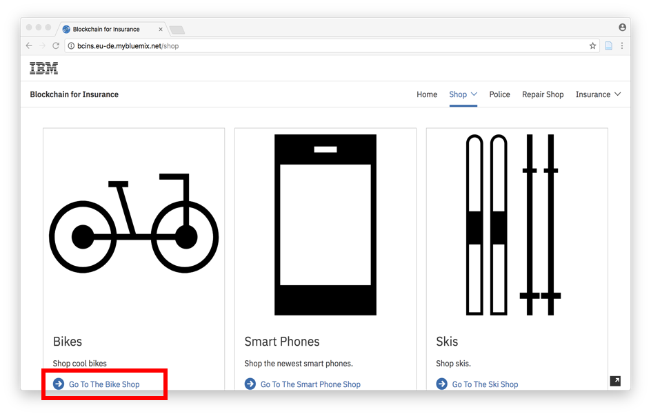
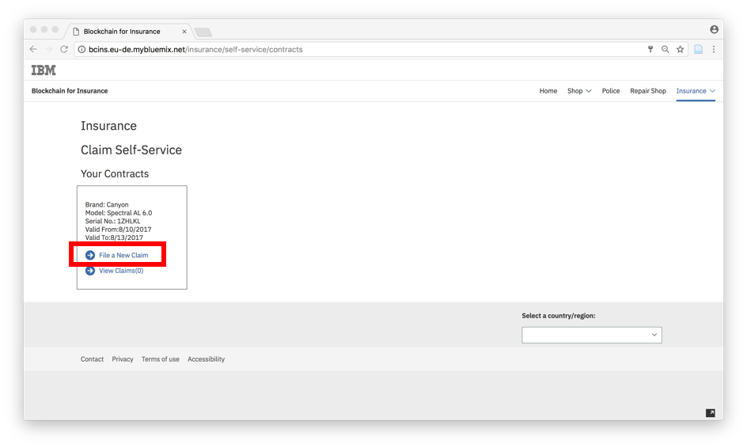
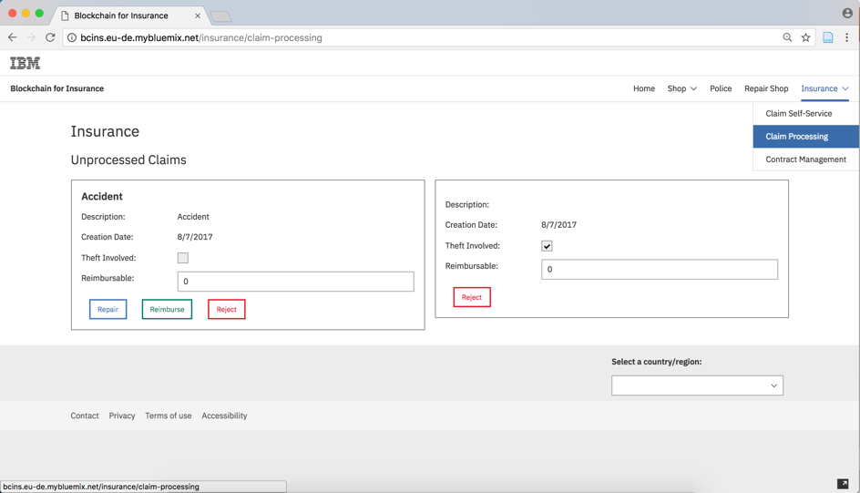
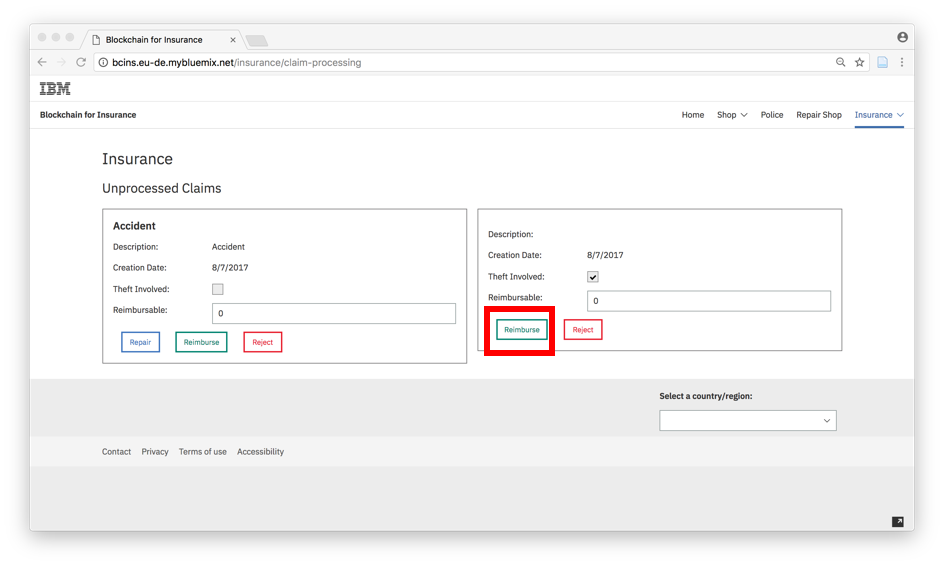
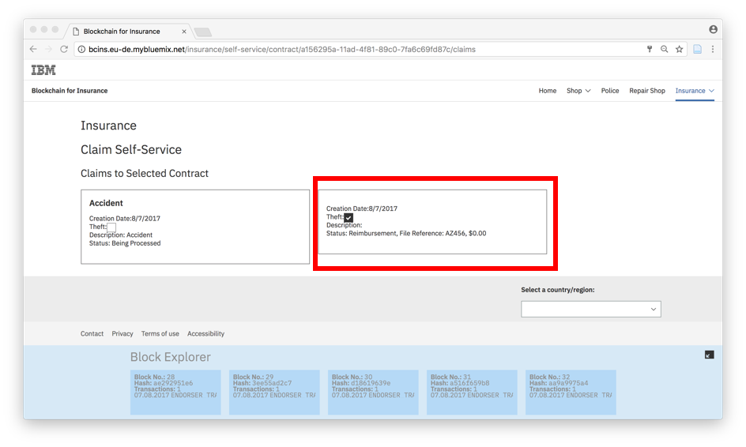
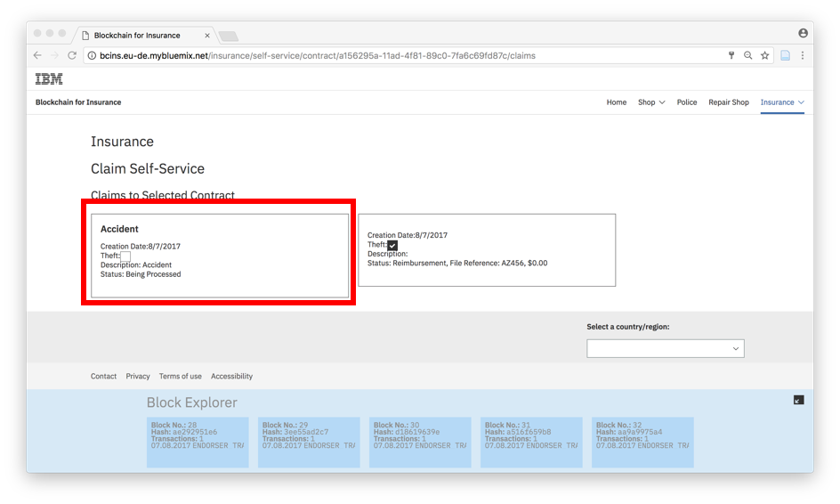
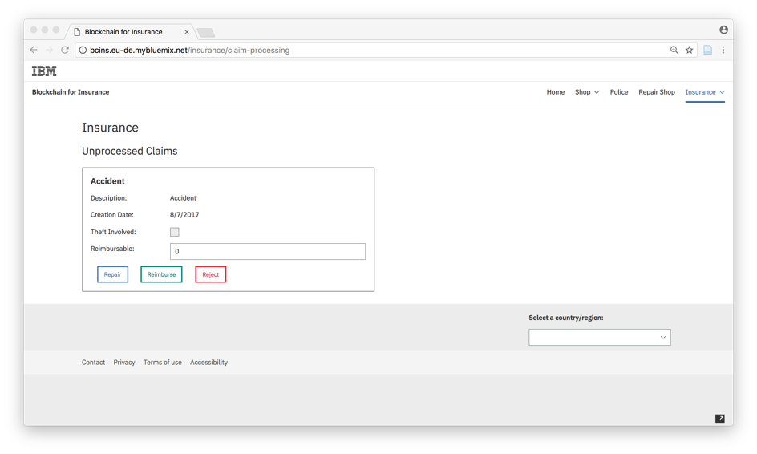

_Phiên bản của các ngôn ngữ khác: [English](README.md), [中国語](README-cn.md), [日本語](README-ja.md)._

# Xây dựng ứng dụng bảo hiểm trên nền tảng Blockchain

Dự án giới thiệu việc sử dụng blockchain trong lĩnh vực bảo hiểm khi xử lý yêu cầu bồi thường. Trong ứng dụng này, chúng tôi có bốn bên tham gia, đó là công ty bảo hiểm, cảnh sát, cửa hàng sửa chữa và cửa hàng bán. Công ty bảo hiểm cung cấp dịch vụ bảo hiểm cho các sản phẩm và xử lý các yêu cầu bồi thường. Phía cảnh sát có trách nhiệm xác minh các vụ việc. Bên cửa hàng sửa chịu hàng chịu trách nhiệm sửa chữa sản phẩm trong khi cửa hàng bán sản phẩm cho người tiêu dùng.

Dành cho: Intermediate Developers

## Các công cụ sử dụng

- Hyperledger Fabric
- Docker

## Biểu đồ luồng của ứng dụng


- Tạo chứng chỉ cho các peers
- Dựng Docker images cho mạng
- Khởi tạo mạng

## Điều kiện tiên quyết

Chúng tôi thấy rằng Blockchain có thể rất khó khăn khi cài đặt Node. Chúng tôi muốn chia sẻ phản hồi StackOverflow này - bởi vì nhiều lần các lỗi bạn thấy với Compose xuất phát từ việc cài đặt phiên bản Node sai hoặc thực hiện một cách tiếp cận không được Compose hỗ trợ:

- [Docker](https://www.docker.com/products) - bản mới nhất
- [Docker Compose](https://docs.docker.com/compose/overview/) - bản mới nhất
- [NPM](https://www.npmjs.com/get-npm) - bản mới nhất
- [nvm]() - bản mới nhất
- [Node.js](https://nodejs.org/en/download/) - bản mới nhất
- [Git client](https://git-scm.com/downloads) - bản mới nhất
- **[Python](https://www.python.org/downloads/) - 2.7.x**

## Các bước thực hiện

1. [Chạy ứng dụng(#1-run-the-application)

## 1. Run the application

Clone repo về máy:

```bash
git clone https://github.com/IBM/build-blockchain-insurance-app
```

Đăng nhập [docker hub](https://hub.docker.com/) với lệnh.

```bash
docker login
```

Chạy lệnh build để tải xuống và tạo docker image cho orderer, công ty bảo hiểm, phía cảnh sát, cửa hàng, bên sửa chữa, ứng dụng web và cơ quan cấp chứng chỉ. Lệnh sẽ mất vài phút để chạy.

Với hệ điều hành MacOS:

```bash
cd build-blockchain-insurance-app
./build_mac.sh
```

Với hệ điều hành Ubuntu:

```bash
cd build-blockchain-insurance-app
./build_ubuntu.sh
```

Bạn sẽ thấy đầu ra ở cửa sổ dòng lệnh xuất hiện như sau:

```
Creating repairshop-ca ...
Creating insurance-ca ...
Creating shop-ca ...
Creating police-ca ...
Creating orderer0 ...
Creating repairshop-ca
Creating insurance-ca
Creating police-ca
Creating shop-ca
Creating orderer0 ... done
Creating insurance-peer ...
Creating insurance-peer ... done
Creating shop-peer ...
Creating shop-peer ... done
Creating repairshop-peer ...
Creating repairshop-peer ... done
Creating web ...
Creating police-peer ...
Creating web
Creating police-peer ... done
```

**Đợi vài phút để ứng dụng cài đặt và khởi tạo hợp đồng thông minh (chaincode) trên mạng**

Kiểm tra trạng thái cài đặt bằng lệnh:

```bash
docker logs web
```

Khi hoàn thành, bạn sẽ thấy đầu ra sau trên cửa sổ dòng lệnh:

```
> blockchain-for-insurance@2.1.0 serve /app
> cross-env NODE_ENV=production&&node ./bin/server

/app/app/static/js
Server running on port: 3000
Default channel not found, attempting creation...
Successfully created a new default channel.
Joining peers to the default channel.
Chaincode is not installed, attempting installation...
Base container image present.
info: [packager/Golang.js]: packaging GOLANG from bcins
info: [packager/Golang.js]: packaging GOLANG from bcins
info: [packager/Golang.js]: packaging GOLANG from bcins
info: [packager/Golang.js]: packaging GOLANG from bcins
Successfully installed chaincode on the default channel.
Successfully instantiated chaincode on all peers.
```

Vào đường dẫn trên trình duyệt http://localhost:3000 để tải trang web.

Trang chủ hiển thị những bên tham gia (Peers) trong mạng. Bạn có thể thấy rằng có Bảo hiểm, Cửa hàng sửa chữa, Cảnh sát và Cửa hàng được triển khai. Họ là những bên tham gia vào mạng.


Giả sử bạn là một người tiêu dùng (gọi là Biker) muốn mua điện thoại, xe đạp hoặc ván trượt tuyết. Bằng cách nhấp chuột vào mục "Go to the shop", bạn sẽ được chuyển hướng đến cửa hàng nơi bạn có thể xem danh mục các sản phẩm.


Bây giờ bạn có thể thấy ba sản phẩm được cung cấp bởi cửa hàng. Ngoài ra, mỗi sản phẩm sẽ đi kèm theo hợp đồng bảo hiểm. Trong kịch bản của chúng tôi, bạn là một người đam mê thể thao ngoài trời muốn mua một chiếc Xe đạp mới. Do đó, bạn sẽ nhấp chuột vào phần Cửa hàng xe đạp (Bike Shop).



In this section, you are viewing the different bikes available in the store. You can select within four different Bikes. By clicking on next you’ll be forwarded to the next page which will ask for the customer’s personal data.

Trong phần này, bạn sẽ xem những chiếc xe đạp khác nhau có sẵn trong cửa hàng. Bạn có thể chọn một trong bốn xe đạp khác nhau. Bằng cách nhấp vào tiếp theo (Next), bạn sẽ được chuyển tiếp đến trang tiếp theo để nhập thông tin cá nhân của mình.


Bạn có thể lựa chọn giữa các loại hợp đồng bảo hiểm khác nhau về các điều khoản và điều kiện. Bạn được yêu cầu nhập dữ liệu cá nhân mình, chọn ngày bắt đầu và ngày kết thúc hợp đồng. Vì các hợp đồng có xu hướng ngắn hạn hoặc theo sự kiện, bạn có thể chọn thời hạn hợp đồng theo từng ngày. Giá hàng ngày của hợp đồng bảo hiểm được tính theo một công thức đã được xác định trong chaincode. Bằng trị cách nhấp chuột vào nút tiếp theo (Next), bạn sẽ được chuyển tiếp đến một màn hình tóm tắt giao dịch của bạn và hiển thị cho bạn tổng số tiền cần chi trả.


Ứng dụng sẽ hiển thị cho bạn tổng số tiền mà bạn mua. Bằng cách nhấp chuột vào đơn đặt hàng (order), bạn sẽ đồng ý với các điều khoản và thỏa thuận (ký kết hợp đồng). Ngoài ra, bạn sẽ nhận được một tên người dùng và mật khẩu duy nhất. Thông tin đăng nhập sẽ được sử dụng khi bạn gửi khiếu nại. Một khối đang được thêm vào Blockchain.

> Lưu ý: Bạn có thể xem khối bằng cách nhấp vào mũi tên ở dưới cùng bên phải.


Thông tin đăng nhập của bạn. Khối được thêm vào chuỗi.


Khi sự cố đã xảy ra, Biker có thể tự nộp đơn khiếu nại bằng cách chọn tab “claim Self-Service”.


Biker sẽ được yêu cầu đăng nhập bằng cách sử dụng thông tin đăng nhập đã được đưa cho trước đó.


Anh ta có thể gửi một yêu cầu mới bằng cách chọn tab shown above.



Biker có thể mô tả ngắn gọn thiệt hại trên chiếc xe đạp của mình và/hoặc chọn xem nó có bị đánh cắp hay không. Trong trường hợp Xe đạp bị mất cắp, yêu cầu bồi thường sẽ được xử lý thông qua cảnh sát, người phải xác nhận hoặc phủ nhận hành vi trộm cắp (tùy chọn 1). Trong trường hợp xe chỉ bị thiệt hại, yêu cầu sẽ được xử lý thông qua cửa hàng sửa chữa (tùy chọn 2). Trong phần sau, chúng ta sẽ bắt đầu với tùy chọn 1.


**Option 1**

Khi Biker đã gửi yêu cầu, nó sẽ được hiển thị trong ô được đánh dấu màu đỏ. Hơn nữa, một khối khác đang được thêm vào chuỗi.


Biker cũng có thể xem các yêu cầu hoạt động. **Lưu ý**: Bạn có thể cần phải đăng nhập lại để xem yêu cầu hoạt động mới.


Bằng cách chọn phần "claim processing", công ty bảo hiểm có thể xem tất cả các khiếu nại chưa được xử lý. Vì chúng tôi vẫn đang xem xét phương án 1, hành vi trộm cắp phải được cảnh sát xác thực hoặc phủ nhận.



Phía cảnh sát có thể xem các khiếu nại trộm cắp. Trong trường hợp chiếc xe đạp đã được báo cáo là bị đánh cắp, họ có thể xác nhận khiếu nại. Trong trường hợp không có hành vi trộm cắp đã được báo cáo, họ có thể từ chối yêu cầu và nó sẽ không được xử lý.


Hãy giả sử Biker báo cáo chiếc xe bị đánh cắp. Cảnh sát sẽ xác nhận khiếu nại và một khối sẽ được thêm vào chuỗi.


Quay trở lại tab “claim processing”, bạn có thể thấy rằng công ty bảo hiểm có tùy chọn cầu bồi thường vì cảnh sát đã xác nhận rằng chiếc xe đã bị đánh cắp.



Biker có thể thấy trạng thái mới của yêu cầu của mình đã được thay đổi và sẵn sàng để được trả tiền bảo hiểm.



**Option 2**
Phương án 2 bao gồm trường hợp bị tai nạn.



Tab “claim processing” cho thấy các yêu cầu chưa được xử lý. Một nhân viên bán hàng có thể chọn giữa ba tùy chọn về cách xử lý khiếu nại. Ngay lập tức, Reject sẽ dừng quá trình yêu cầu bồi thường. Trong trường hợp cần sửa chữa một cái gì đó, công ty bảo hiểm có tùy chọn để chọn sửa chữa trực tuyến. Điều này sẽ chuyển tiếp yêu cầu đến một cửa hàng sửa chữa và sẽ tạo ra một lệnh sửa chữa.



Cửa hàng sửa chữa sẽ nhận được một thông báo hiển thị yêu cầu sửa chữa. Sau khi họ hoàn thành công việc sửa chữa, cửa hàng sửa chữa có thể đánh dấu đơn hàng là đã hoàn thành. Sau đó, công ty bảo hiểm sẽ nhận được tin nhắn để tiến hành thanh toán cho cửa hàng sửa chữa. Một khối sẽ được thêm vào chuỗi.


Biker có thể thấy trong tab “claim self-service”, rằng yêu cầu đã được giải quyết và chiếc xe đã được sửa chữa bởi cửa hàng.


Công ty bảo hiểm có tùy chọn kích hoạt hoặc hủy kích hoạt một số hợp đồng. Điều này không có nghĩa là các hợp đồng đã được ký bởi khách hàng sẽ không còn hiệu lực. Nó chỉ không cho phép ký kết mới cho các loại hợp đồng. Ngoài ra, công ty bảo hiểm có khả năng tạo ra các mẫu hợp đồng mới có các điều khoản và điều kiện khác nhau và một mức giá khác nhau.


## Tài nguyên bổ sung

Danh sách các tài nguyên blockchain bổ sung:

- [Cơ bản về IBM Blockchain](https://www.ibm.com/blockchain/what-is-blockchain)
- [Tài liệu Hyperledger Fabric](https://hyperledger-fabric.readthedocs.io/)
- [Mã nguồn Hyperledger Fabric trên GitHub](https://github.com/hyperledger/fabric)

## Xử lý sự cố

- Chạy lệnh `clean.sh` để xóa docker image và docket container của mạng.

```bash
./clean.sh
```

## Giấy phép

Mã nguồn mẫu này được cấp phép theo giấy phép phần mềm Apache, Phiên bản 2. Các thành phần bên thứ ba được gọi trong mã nguồn này được cấp phép bởi các nhà cung cấp tương ứng theo giấy phép riêng của họ. Các đóng góp tuân theo [Developer Certificate of Origin, Version 1.1 (DCO)](https://developercertificate.org/) và [Apache Software License, Version 2](https://www.apache.org/licenses/LICENSE-2.0.txt).

[Apache Software License (ASL) FAQ](https://www.apache.org/foundation/license-faq.html#WhatDoesItMEAN)
